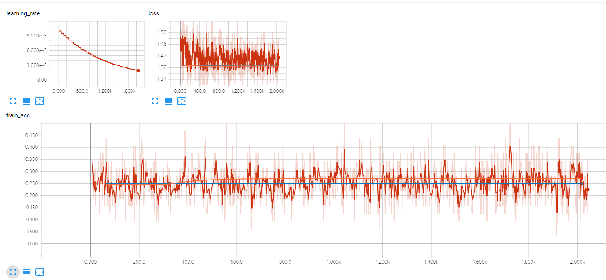
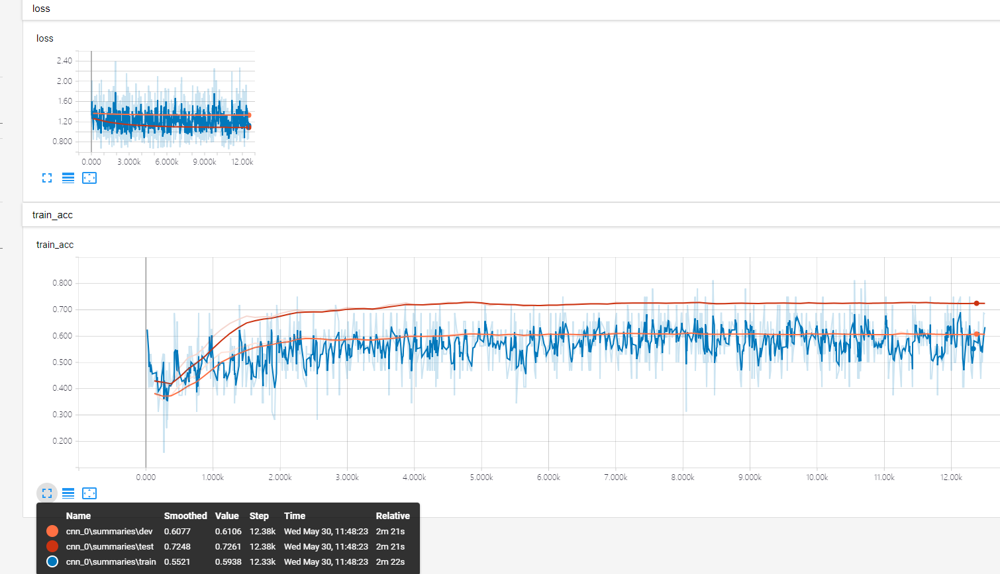

# Notes
All implementations are not guaranteed to be correct, have not been checked by original authors, only reimplemented from the paper description.

# original paper
Contains the original paper and model of EEGNet

# tf_EEGNet
It's a tensorflow implementation for EEGNet

for more information see https://github.com/vlawhern/arl-eegmodels

# tf_ConvNet
It's a tensorflow implementation for ConvNet

for more information see https://github.com/robintibor/braindevel

# Leave-one-subject-out Experments

## Model: tf_EEGNet

### Preprocessing for BCI_competion 2a
    1. A trial contained 2s and was extraced 0.5s after the cue was given.
    2. A 4-38Hz bandpass was done by a causal 6-order Butterworth fliter.
    3. The MI dataset was sampled at 250Hz. And it was resampled to 128Hz for EEGnet.

tf_EEGNet just cannont converged on BCI_competion 2a even in the train set. And it would predit the same labels for all trials of test set and got a 25% acc.

### Preprocessing for P300
    Only resampling to 128Hz was done.

The P300 dataset was sampled at 2048Hz and contains 11 sujbect. Each trial is 0.5s long.
This data set category is not balanced, has a proportion of 9.23 for 1 aginst 0.

tf_EEGNet did not have the ability to overfit on train set. After the unbalance_weights was added in the loss function, the prediction for test set would not be the same.

## Model: tf_ConvNet
### Preprocessing for BCI_competion 2a
    1. A trial contained 2s and was extraced 0.5s after the cue was given.
    2. A 4-38Hz bandpass was done by a causal 6-order Butterworth fliter.
    3. No resampling.

Got something hard to explain.

| Result |  acc | mean |
|---|---|---|
| Train_acc | 0.4529,0.5208,0.4856,0.4886,0.5233,0.4891,0.5293,0.5109,0.4588 | 0.49548 |
| Best_val_acc | 0.4271,0.4896,0.4271,0.4167,0.4444,0.4583,0.4653,0.4236,0.3854 | 0.4375 |
| Earlystopping test_acc | 0.4965,0.2812,0.5278,0.3542,0.2222,0.3264,0.2812,0.5729,0.5660 | 0.40316 |
| Last_val_acc | 0.4201,0.4861,0.4167,0.4028,0.4340,0.4444,0.4583,0.4201,0.3819 | 0.42938 |
| Last_test_acc | 0.5104,0.2813,0.5208,0.3438,0.2188,0.3299,0.2847,0.5694,0.5660 | 0.40278 |
